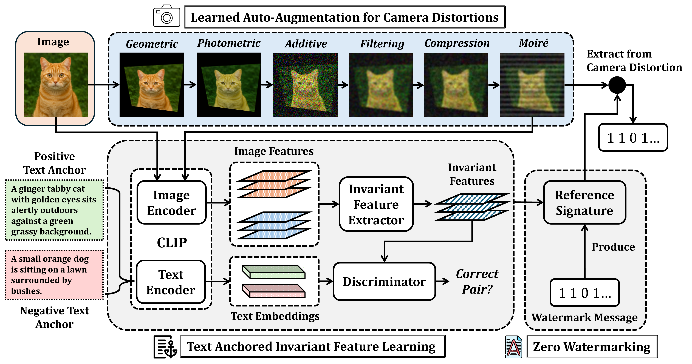

**TIACam: Text-Anchored Invariant Feature Learning with Auto-Augmentation for Camera-Robust Zero-Watermarking**

Paper: https://arxiv.org/abs/2602.18863

---

## Overview

TIACam is a robust zero-watermarking framework designed for real-world camera distortions. Unlike traditional watermarking systems that directly modify image pixels, TIACam learns distortion-invariant semantic representations using multimodal adversarial learning and learned camera-aware augmentations.

The framework combines:

- Learned auto-augmentation for realistic camera distortions
- CLIP-based multimodal image-text alignment
- Adversarial invariant feature learning
- Robust zero-watermarking from invariant representations

TIACam is designed to remain robust under:

- Perspective distortions
- Photometric distortions
- Additive noise
- Filtering blur
- Compression artifacts
- Moiré distortions
- Real screen-camera captures
- Print-camera captures

---

# Framework

<p align="center">
  
</p>

The framework consists of three major components:

1. **Learned Auto-Augmentation**
   - Learns realistic camera distortions using trainable augmentation modules

2. **Text-Anchored Invariant Feature Learning**
   - Aligns image and text semantics under distortions
   - Uses adversarial training with positive and negative text anchors

3. **Zero-Watermarking**
   - Generates robust watermark signatures from invariant features

---

# Key Features

- Camera-robust invariant feature learning
- Adversarial multimodal alignment
- Learned differentiable distortion modules
- CLIP-based semantic supervision
- Zero-watermarking without modifying original image pixels
- Robustness against multiple simultaneous distortions
- Modular PyTorch implementation

---

# Repository Structure

```bash
TIACam/
│
├── augmentors/
│   ├── filtering/
│   ├── jpeg/
│   ├── moire/
│   ├── perspective/
│   └── photometric/
│
├── invariant_learning/
│   ├── clip/
│   ├── datasets/
│   ├── distortions/
│   ├── models/
│   ├── training/
│   └── utils/
│
└── assets/
```

---

# Installation

## Clone Repository

```bash
git clone https://github.com/your_username/TIACam.git
cd TIACam
```

## Create Environment

```bash
conda create -n tiacam python=3.10
conda activate tiacam
```

## Install Dependencies

```bash
pip install -r requirements.txt
```

---

# Dataset Preparation

Prepare the dataset using the following structure:

```bash
dataset/
└── final/
    ├── images/
    │   ├── 1.jpg
    │   ├── 2.jpg
    │   └── ...
    │
    └── labels/
        ├── 1.txt
        ├── 2.txt
        └── ...
```

Each `.txt` file should contain object labels associated with the image.

Example:

```text
cat
grass
tree
outdoor
```

---

# Learned Auto-Augmentation

The repository contains trainable distortion modules for:

| Distortion Type | Module |
|---|---|
| Geometric | Perspective |
| Photometric | Photometric |
| Additive Noise | Additive |
| Filtering Blur | Filtering |
| Compression | JPEG |
| Moiré | Moiré |

---

# Train Distortion Modules

## Filtering

```bash
python augmentors/filtering/train.py
```

## JPEG

```bash
python augmentors/jpeg/train.py
```

## Moiré

```bash
python augmentors/moire/train.py
```

## Perspective

```bash
python augmentors/perspective/train.py
```

## Photometric

```bash
python augmentors/photometric/train.py --mode multiplicative
```

## Additive

```bash
python augmentors/photometric/train.py \
    --mode additive \
    --save_path outputs/checkpoints/additive.pth
```

---

# Invariant Feature Learning

Train the TIACam invariant feature learning framework:

```bash
python invariant_learning/training/train.py
```

The training pipeline includes:

- Random distortion sampling
- CLIP feature extraction
- Positive/negative text-anchor construction
- Adversarial invariant learning
- Multimodal semantic alignment

---

# Model Architecture

## Generator

The generator learns distortion-invariant semantic representations from CLIP embeddings using:

- Residual MLP blocks
- Feature fusion
- Projection heads
- L2-normalized embedding space

## Discriminator

The discriminator uses a transformer-based architecture to distinguish:

- Correct image-text semantic pairs
- Incorrect image-text semantic pairs

---

# Training Objective

The framework optimizes:

- Adversarial alignment loss
- Positive semantic similarity
- Negative semantic repulsion
- Distortion consistency

The objective encourages:

- Semantic preservation
- Distortion invariance
- Cross-modal alignment

---

# Citation

If you find this work useful, please cite:

```bibtex
@article{tanvir2026tiacam,
  title={TIACam: Text-Anchored Invariant Feature Learning with Auto-Augmentation for Camera-Robust Zero-Watermarking},
  author={Tanvir, Abdullah All, Dasgupta, Agnibh, Zhong, Xin},
  journal={arXiv preprint arXiv:2602.18863},
  year={2026}
}
```

---

# Acknowledgements

This work uses:

- OpenAI CLIP
- PyTorch
- HuggingFace Transformers
- torchvision

---

# License

This repository is released under the MIT License.
